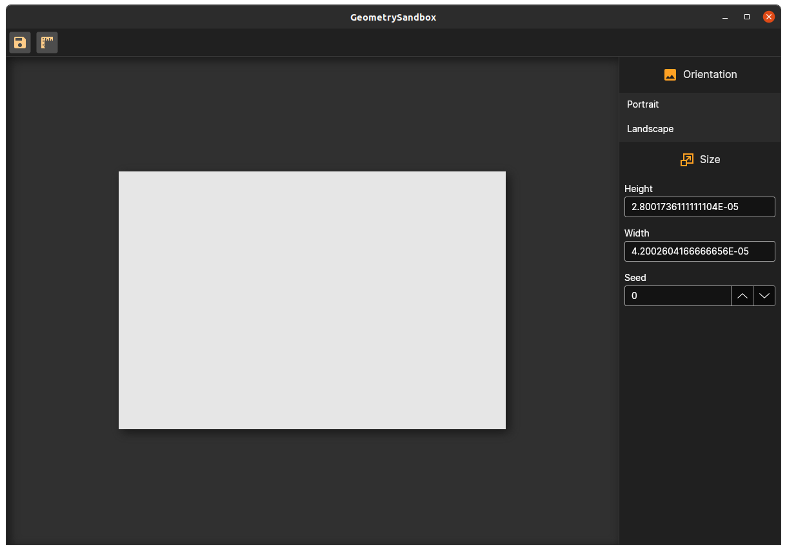

[fantomas]: https://github.com/fsprojects/fantomas
[f# formatting]: https://marketplace.visualstudio.com/items?itemName=asti.fantomas-vs
[fable]: https://fable.io/

# GeometrySandbox

This is a framework to get started creating generative art in F#. This framework's goal is to get you up and running
creating generative art as fast as possible! The aim of this framework is to enable everything in the workflow of making
creative works within a beautiful environment but still allow your work to go to living anywhere you want it to go. If
you want this work to live on a wall, resizing and saving is made easy for you. Let's say that you made an animation and
want people to be able to see the animation playing online. You can either export the rendering as a video or gif
format. If you really want to allow the user to have full interaction with the work you are creating, you can even embed
the code into your website by converting your animation into javascript with [Fable].




# Development

To run this application just type

```sh
dotnet run
```